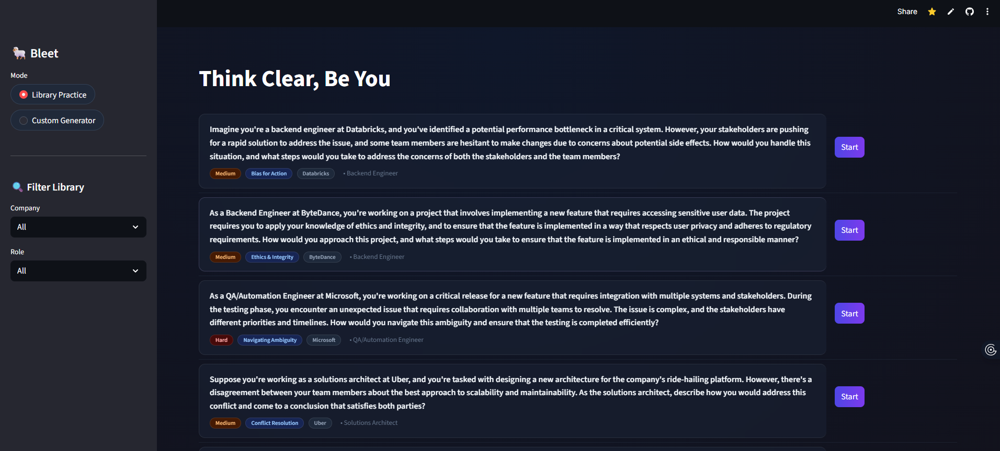
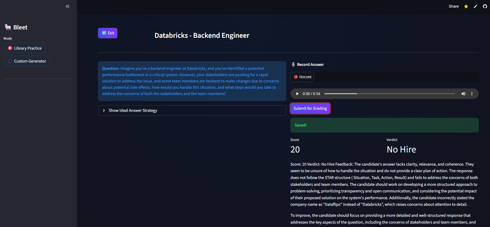

# 🐑 Bleet: The AI Behavioral Interview Coach


**Bleet** is an AI-powered platform designed to master the hardest part of tech interviews: **The Behavioral Round.** Unlike generic flashcards, Bleet uses **Llama 3 (via Groq)** to generate highly specific scenario-based questions from your actual Resume and Job Description, ensuring you practice for the *exact* role you want.

🔗 **[Live Demo](https://datadriven-vee-bleet-app-8cva1x.streamlit.app)** | 🎥 **[Video Demo](#)** ---

## 🚀 Key Features

### 1. ⚡ Custom "Bar Raiser" Generator
Stop practicing "Tell me about a time you failed." Bleet reads your **PDF Resume** and the **Job Description** to generate 7 specific, high-context scenarios.
* *Input:* "I built a RAG pipeline using LangChain."
* *Bleet asks:* "In your RAG project, tell me about a specific limitation you found in LangChain's retrieval and how you engineered a workaround."

### 2. 🏟️ The Arena (Question Library)
A curated database of top behavioral questions from companies like **Amazon, Google, and Databricks**.
* **Tag Cloud Filtering:** Filter by Difficulty (Easy -> Expert) or Company.
* **Glassmorphism UI:** A modern, distraction-free interface to keep you focused.

### 3. 🎙️ AI Voice Coaching
* **Record:** Answer questions verbally in the browser.
* **Transcribe:** Uses **Whisper-large-v3** for near-perfect speech-to-text.
* **Grade:** **Llama 3** acts as a Senior Recruiter, grading your answer on the **STAR Method** (Situation, Task, Action, Result) and providing a 0-100 score with specific feedback.

---

## 🛠️ Tech Stack

* **Frontend:** Streamlit (Custom CSS, Glassmorphism UI)
* **Database:** Supabase (PostgreSQL for questions, Storage for audio files)
* **AI Inference:** Groq Cloud (Llama 3.3 70B Versatile)
* **Audio Processing:** OpenAI Whisper (via Groq)

---

## 📸 Screenshots

| The Arena | AI Grading |
|:---:|:---:|
|  |  |


---

## 🏃‍♂️ How to Run Locally

1. **Clone the repository**
   ```bash
   git clone [https://github.com/datadriven-vee/Bleet.git](https://github.com/datadriven-vee/Bleet.git)
   cd Bleet
